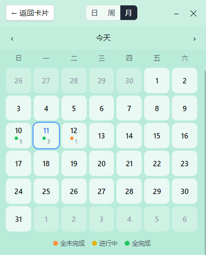

# FloatingTodo - 悬浮待办 + 日历复盘

一个 Windows 桌面端的"悬浮便签待办 + 内置日历视图"应用。所有数据本地保存，无需联网，无需登录。

> 个人向小工具，基于自身需求开发，功能按需迭代，不保证稳定性。



## ✨ 功能

### 悬浮待办卡片
- 🖼️ **无边框透明悬浮窗** — 像一张便签贴在桌面上
- ↕️ **可拖动 + 可调整大小** — 位置和尺寸自动记忆
- 📅 **顶部显示日期** — 例 `2026.4.26`
- ✅ **待办事项管理** — 增删改、双击编辑、勾选完成（带删除线）
- 🎨 **背景设置** — 8 种预设便签色 + 自定义 HEX 颜色 + 本地图片背景

### 内置日历视图
- 点击右上角工具栏的 **📅 日历** 图标即可切换
- 支持 **日 / 周 / 月** 三种视图
- 月视图：每天显示完成进度（橙=未开始 / 黄=进行中 / 绿=全完成）
- 周视图：列表式查看一周事项
- 点击任意日期 → 切回待办卡片，编辑那一天的事项

### 数据持久化
所有数据（待办、卡片位置/尺寸、背景、视图模式）通过 `electron-store` 保存在系统用户目录：
```
%APPDATA%/floating-todo/config.json
```

> 图片背景以 base64 编码内嵌于 config.json，无需额外目录。

---

## 🚀 直接运行

无需安装开发环境，从
[点击下载 Windows 安装包](https://github.com/NOWucc/floating-todo/releases/latest)
后双击即可运行。
---

## 🛠️ 开发

### 环境要求
- Node.js 18+
- npm 9+
- Windows（开发与运行均可，打包目标也是 Windows）

### 启动开发模式
```bash
npm install
npm run dev
```

开发模式下窗口自带 DevTools，方便调试。

### 打包 exe
```bash
npm run build
```

产物输出至 `release/` 目录。

---

## 🏗️ 架构

```
floating-todo/
├── electron/              # 主进程
│   ├── main.ts            # 窗口管理、IPC、文件对话框
│   └── preload.ts         # 安全 IPC 桥
├── src/
│   ├── App.tsx            # 视图切换根组件
│   ├── components/
│   │   ├── TodoCard/      # 悬浮卡片 + 待办列表 + 背景设置
│   │   └── Calendar/      # 日 / 周 / 月视图
│   ├── store/             # Zustand 全局状态（含持久化桥接）
│   ├── utils/             # 日期工具
│   └── types/
```

**技术栈**：Electron 33 + React 18 + TypeScript + Tailwind CSS + Zustand + electron-store

---

## 🐛 已知问题

- **界面样式** — 整体 UI 仍需打磨优化

---

## 📋 后续可扩展功能
- [ ] 按周/月统计完成率图表
---

## 📄 License

MIT
